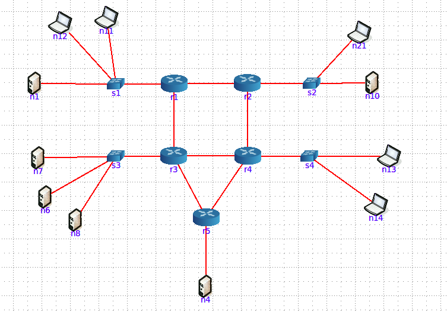
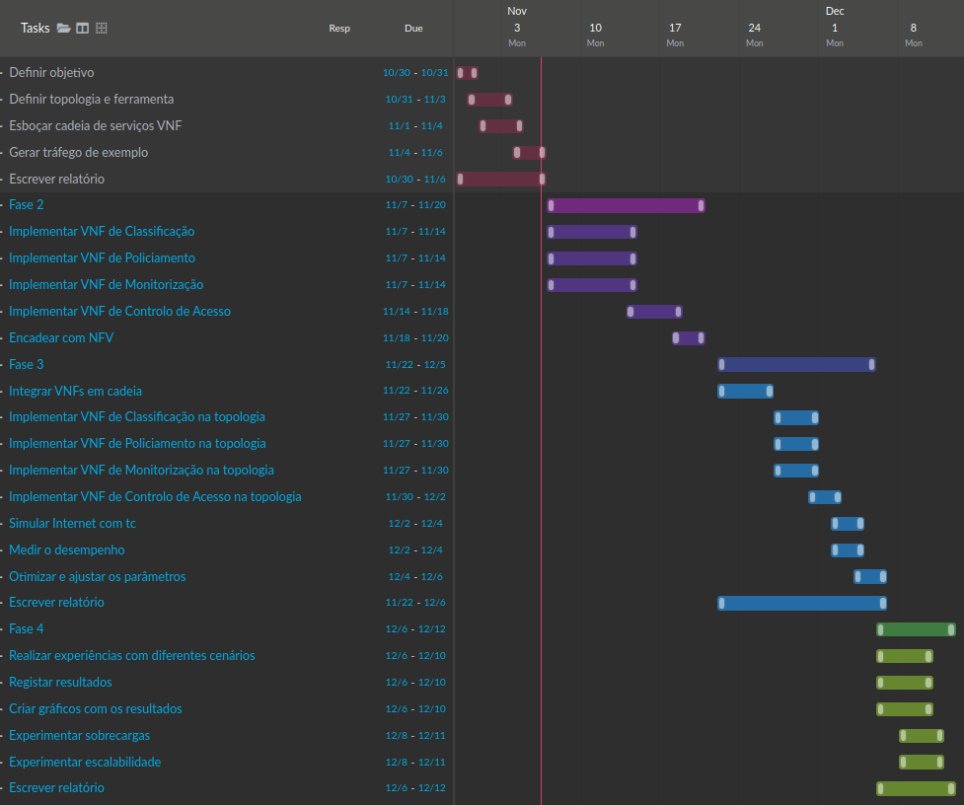

# QSI-TP3

## Arquitetura e VNFs

Para este trabalho, decidimos focar-nos nos seguintes aspetos de QoS:

- Classificação
- Policiamento
- Monitorização
- Controlo de Acesso

O objetivo principal de definir estas VNFs será priorizar _streaming_ local de vídeos.

### VNF de Classificação

Para aplicar estes aspetos a nossa ideia para a aplicação iniciaria com a identificação de cada pacote de tráfego com o IP de origem/destino, tamanho, TTL e distinguir o seu protocolo (HTTP, TCP, RTP), utilizando a ferramenta _Scapy_ em Python, com o objetivo de priorizar pacotes menores e protocolos relacionados com _streaming_ tal como RTP.

### VNF de Policiamento

De seguida, para testar o _streaming_ de um vídeo com alguma limitação, iremos utilizar a ferramenta `tc` já definida no Linux para entender os comportamentos ao aplicar atraso num pacote ou limitar o débito no recetor.

### VNF de Monitorização

Para monitorizar o tráfego a aplicação será responsável pela medição de métricas como débito, perda de pacotes e delay utilizando a ferramenta _Prometheus_ e visualizando os resultados através do _Grafana_.

### VNF de Controlo de Acesso

Para dar prioridade a tráfego necessário para _streaming_, e com a informação definida pela VNF de Classificação, será implementada uma _firewall_ virtual que será então responsável por dar prioridade a esses pacotes como RTP e, no caso de _streaming_ para um website, HTTP.

## Topologia

A seguinte topologia servirá de base para o trabalho.

O diagrama foi desenhado no GUI do **CORE**, para efeitos de ilustração, mas a implementação concreta realizada através do API **Mininet** em Python. A intenção é representar uma versão simplificada de uma topologia de um ISP, com _switches_, _routers_ e _hosts_.

## Tráfego de Exemplo

Para gerar tráfego de exemplo, utilizamos também as funcionalidades do **Mininet**. Para fazer isso simulamos as diferentes caraterísticas dos três tipos de tráfego pedidos como exemplo.

- VoIP precisa de baixa largura de banda, mas precisa de baixa latência e jitter.
- Streaming precisa de uso alto de largura de banda e jitter moderado.
- Transferência de Dados não tem limite fixo (best effort), mas não permite perdas.

Com essas carateristicas, fazemos um iperf que obriga o uso específico desses três casos para funcionar como um exemplo válido de tráfego.

- VoIP: iperf -u -b 100K
- Streaming: iperf -u -b 5M
- Transferência de Dados: iperf -t 20

## Trabalho Futuro

O diagrama de Gantt abaixo representa o fluxo de trabalho para as restantes semanas, tendo em conta as fases descritas no enunciado, os requisitos e a divisão por elementos de grupo para cada tarefa.

